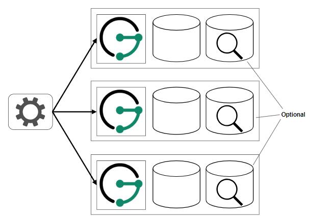
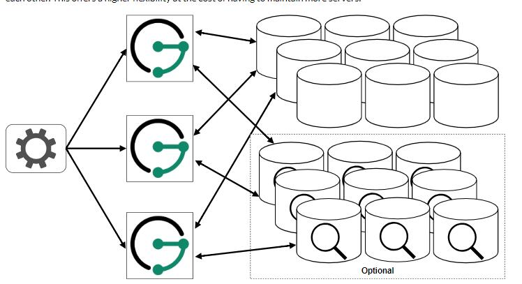

8.部署方案
---
JanusGraph提供了多种存储和索引后端选项，可以灵活地部署它们。本章介绍了一些可能的部署方案，以帮助解决这种灵活性带来的复杂性。  

在讨论不同的部署方案之前，了解JanusGraph本身和后端的角色非常重要。首先，应用程序只与JanusGraph直接通信，主要是通过发送Gremlin traversals来执行。JanusGraph然后与配置的后端通信以执行接收的traversals。当JanusGraph以JanusGraph Server的形式使用时，就没有像JanusGraph Server 这样的master节点了。因此，应用程序可以连接到任何JanusGraph Server实例。他们还可以使用负载均衡来安排对不同实例的请求。JanusGraph Server实例本身不直接相互通信，这使得在需要处理更多traversals时可以轻松扩展它们。  

>注意:本章中介绍的场景仅是JanusGraph如何部署的示例。每个部署都需要考虑具体的用例和生产需求。  

#### 8.1 入门场景
这种情况是大多数用户在刚刚开始使用JanusGraph时可能想要选择的场景。它提供可扩展性和容错性，并且所需服务器数量最少。JanusGraph Server与存储后端的实例一起运行，并且可以选择在每个服务器上运行索引后端的实例。

通过简单地添加更多相同类型的服务器或将其中一个组件移动到专用服务器上，可以扩展这样的设置。后者描述了将部署转换为高级场景的方式。

任何可扩展存储后端都可以与此方案一起使用。但请注意，对于Scylla，当托管与此方案中的其他服务共存时，需要进行一些配置。当在这种情况下应该使用索引后端时，它也需要是可扩展的
#### 8.2 高级场景

高级方案是第8.1节“入门方案”的演变。它们不是将JanusGraph Server实例与存储后端以及可选的索引后端一起托管，而是在不同的服务器上分开。在不同服务器上托管不同组件（JanusGraph服务器，存储/索引后端）的优势在于它们可以相互独立地进行扩展和管理。这提供了更高的灵活性，但代价是必须维护更多的服务器。

由于此方案提供了不同组件的独立可伸缩性，因此使用可扩展后端当然也是最有意义的。

8.3 极简主义情景

可以在一台服务器上将JanusGraph Server与后端一起管理。这对于测试目的尤其有吸引力，例如，当JanusGraph只支持单个应用程序时，该应用程序也可以在同一服务器上运行。

与之前的方案相反，对于不可扩展的此方案使用后端是最有意义的。内存后端可用于测试目的，或Berkeley DB用于生产，Lucene可用作可选索引后端。

#### 8.4 嵌入式JanusGraph
除了从应用程序连接到JanusGraph服务器之外，还可以将JanusGraph作为库嵌入基于JVM的应用程序中。虽然这减少了管理开销，但却无法独立于应用程序扩展JanusGraph。嵌入式JanusGraph可以作为任何其他方案的变体进行部署。JanusGraph只是从服务器直接移动到应用程序，因为它现在只用作库而不是独立服务。